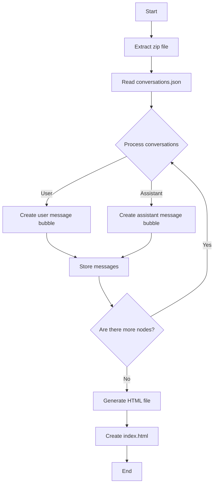

```mermaid
flowchart TD
    A[Start] --> B[Extract zip file]
    B --> C[Read conversations.json]
    C --> D{Process conversations}
    D -->|User| E[Create user message bubble]
    D -->|Assistant| F[Create assistant message bubble]
    E --> G[Store messages]
    F --> G
    G --> H{Are there more nodes?}
    H -->|Yes| D
    H -->|No| I[Generate HTML file]
    I --> J[Create index.html]
    J --> K[End]
```