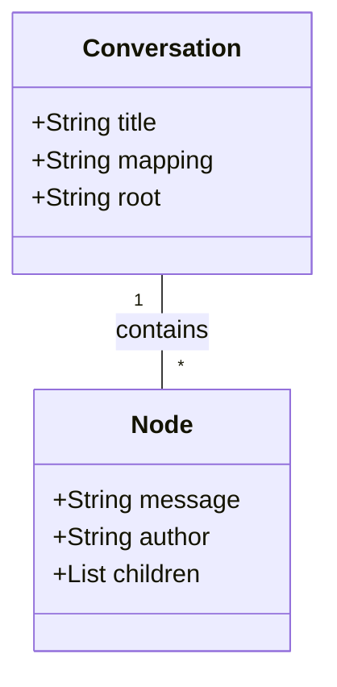

```mermaid
classDiagram
    class Conversation {
        +String title
        +String mapping
        +String root
    }
    class Node {
        +String message
        +String author
        +List children
    }
    Conversation "1" -- "*" Node : contains
```